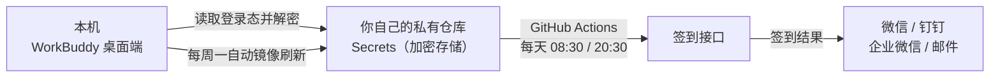

# WorkBuddy 云端自动签到

> 把 WorkBuddy 每日积分签到搬上 GitHub Actions：**电脑不开机也能签到**，签完直接把结果推到你微信。
> 一次配置约 10 分钟，之后长期无人值守。

[](LICENSE)
[](#兼容性实测与未验证)
[](https://github.com/features/actions)

---

## 它解决什么问题

日常签到依赖「打开桌面客户端」，于是周末、假期、出差不开机就断签。本项目把这个动作挪到云端：

- 每天 **北京时间 08:30** 自动签到，**20:30 再兜一次底**
- 结果推送到**微信 / 钉钉 / 企业微信 / 邮件**（只在成功或异常时推，不刷屏）
- 令牌自动续期镜像，正常无需手动维护
- 全程**只用你自己的 GitHub 账号**，不经过任何第三方服务器

## 工作原理



1. **本机**：只读你本机的登录态文件，还原出登录令牌（不修改、不上传别处）
2. **上传**：令牌写进**你自己账号下的私有仓库** Secrets，GitHub 静态加密存储
3. **云端**：GitHub Actions 定时用该令牌调用签到接口，**接口幂等**，重复跑不会出问题

签到接口是幂等的，所以「主干 + 兜底」两条定时任务零风险；即使两条都撞上，第二次也只会返回「今日已签到」。

## 三步上手

### 前置条件

| 项 | 要求 | 说明 |
|---|---|---|
| 系统 | Windows / macOS / Linux | Windows 已实测全链路 |
| Shell | bash | Windows 用 **Git Bash**；若装了 WorkBuddy 客户端，自带 PortableGit，**无需另外安装 Git** |
| GitHub CLI | `gh` | [安装](https://cli.github.com/)，首次使用要 `gh auth login` |
| Node.js | 可选 | 没装也能跑（会自动改用客户端自带的运行时解密） |
| 账号 | WorkBuddy 桌面端已登录 | 令牌从这里来 |

### 第 1 步 · 环境自检

```bash
bash scripts/preflight.sh
```

逐项检查系统、bash、`gh`、登录态、网络连通性，**缺什么直接给出可复制的修复命令**。

### 第 2 步 · 登录 GitHub

```bash
gh auth login --hostname github.com --git-protocol https --web
```

> 网络不通时先开代理再执行。

### 第 3 步 · 一键配置

```bash
bash scripts/setup-cloud-repo.sh
```

脚本会：建一个**私有**仓库（默认名 `workbuddy-checkin`）→ 把你本机令牌写入该仓库 Secrets → 推上工作流 → 立即触发一次运行做**端到端验收**。

跑完到仓库的 **Actions** 页看一眼：出现绿色对勾即成功。

## 不想敲命令？双击 `Start.bat`

Windows 下直接双击技能目录里的 `Start.bat`，中文菜单八项操作：

| 序号 | 操作 |
|---|---|
| 1 | 环境自检 ← **第一次先跑这个** |
| 2 | 一键配置云端签到 |
| 3 | 立即补签一次 |
| 4 | 查看最近运行记录 |
| 5 | 镜像本机令牌（建议每周） |
| 6 | 测试通知渠道 |
| 7 | 云端令牌体检 |
| 8 | 本机直连签到（兜底） |

## 命令速查

| 想做什么 | 命令 |
|---|---|
| 环境自检 | `bash scripts/preflight.sh` |
| 一键配置云端签到 | `bash scripts/setup-cloud-repo.sh` |
| 立即补签一次 | `bash scripts/cloud-run-checkin.sh` |
| 查看最近 8 次运行 | `bash scripts/cloud-run-checkin.sh --status` |
| 刷新云端令牌（每周） | `bash scripts/push-token-to-cloud.sh` |
| 测试通知渠道 | `bash scripts/cloud-notify-test.sh` |
| 云端令牌体检 | `bash scripts/cloud-diag.sh` |
| 本机直连签到（GitHub 挂了时） | `bash scripts/local-checkin.sh` |
| 本机令牌指纹（对照用） | `bash scripts/token-fingerprint.sh` |
| 只同步云端模板文件 | `bash scripts/push-cloud-files.sh --dry-run` |

## 配置项（GitHub Secrets）

`WB_CHECKIN_TOKEN` 与 `WB_CHECKIN_UID` 由第 3 步自动写入，其余按需自行添加（仓库 → Settings → Secrets and variables → Actions）：

| Secret | 必填 | 用途 |
|---|---|---|
| `WB_CHECKIN_TOKEN` | ✅ | 登录令牌（自动写入） |
| `WB_CHECKIN_UID` | ✅ | 账号 uid（自动写入） |
| `NOTIFY_SERVERCHAN_KEY` | ⭕ | [Server 酱](https://sct.ftqq.com/) SendKey → **推到微信**（个人微信最省事的通路） |
| `NOTIFY_ROBOT_URL` | ⭕ | 钉钉 / 企业微信机器人 webhook |
| `NOTIFY_ROBOT_SECRET` | ⭕ | 机器人加签密钥（钉钉加签场景） |
| `SMTP_HOST` `SMTP_PORT` `SMTP_USER` `SMTP_PASS` `SMTP_TO` | ⭕ | 邮件通知；`SMTP_PASS` 填邮箱**授权码**，不是登录密码 |
| `WB_TEST_OLD_TOKEN` | ⭕ | 仅诊断用，可忽略 |

通知渠道配置细节见 [`references/notify-channels.md`](references/notify-channels.md)。

## 关键设计（为什么这样能行）

- **令牌寿命 55 天**，是**无状态 JWT**：服务端只按自身 `exp` 校验，**不存在「新令牌签出、旧令牌被踢」**。实测同一时刻新旧两把令牌同场均返回 200、人为损坏的令牌返回 401，因此「每周镜像一次」没有时序风险。
- **签到接口幂等**：一天内重复调用安全，这是敢加兜底任务的前提。
- **主干 08:30 + 兜底 20:30**（GitHub cron 用 UTC，故为 `30 0 * * *` / `30 12 * * *`）：只有一条 cron 时，若那次运行整体未发生（GitHub 高负载延迟、排队 job 被丢弃），当天就静默漏签；两条互为保险。
- **仓库地址三级自动解析**：`WB_REPO` 环境变量 → `state/cloud-repo.txt` → 按 `gh` 登录账号自动推断。**所以你不需要改任何脚本里的仓库名。**
- **鉴权只看真实 HTTP 状态码**，绝不用 grep 响应体判断——响应体里随机 UUID 的 `requestId` 含 `401` 字样，会造成约 0.57%／次的误判。

## 目录结构

```
workbuddy-cloud-checkin/
├─ SKILL.md                总览与上手说明
├─ Start.bat               Windows 双击菜单
├─ scripts/                本机侧脚本（自检 / 配置 / 补签 / 令牌镜像 / 通知测试 / 兜底签到）
│  ├─ lib-common.sh        公共库：gh・node・python 定位、仓库解析、跨平台工具
│  └─ decrypt-*.js         本机登录态解密链
├─ cloud/
│  ├─ workflow-checkin.yml 工作流模板（含主干 + 兜底两条 cron）
│  └─ repo/                推送到你私有仓库的内容（工作流 + 通知脚本 + README）
└─ references/             排错手册、通知渠道、原理、安全、以及「如何把技能做成可分享版」
```

## 常见问题

**会泄露我的令牌吗？**
不会。令牌只写进**你自己私有仓库**的 Secrets（GitHub 加密存储），仓库里只有代码与文档，本仓库发布前已逐项扫描确认无任何凭据。日志中令牌、SendKey、uid 一律脱敏。

**电脑要一直开着吗？**
不需要，这正是本项目的目的。唯一例外：令牌 55 天过期，需要**至少 55 天打开一次桌面端**刷新；本工具默认每周一自动把新令牌镜像到云端，实际无需你操心。

**会不会一天签两次？**
接口幂等，第二次只会返回「今日已签到」。

**云端失败了怎么手动补？**
三条路任选：手机浏览器进仓库 Actions 页点 **Run workflow**；或本机 `bash scripts/cloud-run-checkin.sh`；或 `bash scripts/local-checkin.sh` 直连签到。
⚠️ 用 Run workflow 时**只能勾选默认的签到选项**，不要勾 `diag` / `notify_test` 等内部选项。

**我需要装 Git / Node / Python 吗？**
Windows 上装了 WorkBuddy 客户端就自带 Git Bash（PortableGit），无需另装。Node 与 Python 都是可选，缺失时脚本会自动降级。

**支持 macOS / Linux 吗？**
见下节。

## 兼容性：实测与未验证

| 平台 | 状态 |
|---|---|
| Windows | ✅ **全链路已实机验证**（含双击菜单、解密链、云端验收） |
| macOS / Linux | ⚠️ 脚本已做适配（跨平台解密路径、BSD `base64` 无 `-w0`、无 `tzdata` 时算北京时间），但**未在真机上跑过**。欢迎反馈 issue |

## 安全与隐私

详见 [`SECURITY.md`](SECURITY.md)。三条要点：

1. 本项目会读取**你本机**的登录态，请**不要运行来源不明的 fork**——被改过的副本可能把令牌发去别处。
2. `state/` 目录记录你的私有仓库名与令牌指纹（**不含令牌原文**），已在 `.gitignore` 中，请勿外传。
3. 若误提交了真实凭据：**先去平台吊销/重置**，再清理历史。历史会被 fork 与缓存，撤销凭据才是真正止血。

## 免责声明

- 本项目为**非官方**工具，与 WorkBuddy 及其开发运营方**无任何关联**，未获其授权或认可。
- 仅供**个人学习与技术研究**使用。请自行阅读并遵守目标服务的用户协议；**自动化操作可能不符合其服务条款，由此产生的账号风险由使用者自负**。
- 请勿用于批量注册、多账号薅取或任何商业牟利用途。
- 软件按「原样」提供，不附带任何担保，作者不对使用后果承担责任。

## English TL;DR

Runs your **own** WorkBuddy daily check-in on GitHub Actions so it works even when your computer is off.
Your login token is read locally and stored only in **your own private repo's Secrets**; results are pushed to WeChat / DingTalk / WeCom / email.
Main run at 08:30 Beijing time with a 20:30 fallback. Setup: `bash scripts/preflight.sh` → `gh auth login` → `bash scripts/setup-cloud-repo.sh` (~10 min).
Unofficial and unaffiliated; for personal use at your own risk. Windows fully tested; macOS/Linux adapted but untested.

## License

[MIT](LICENSE)
